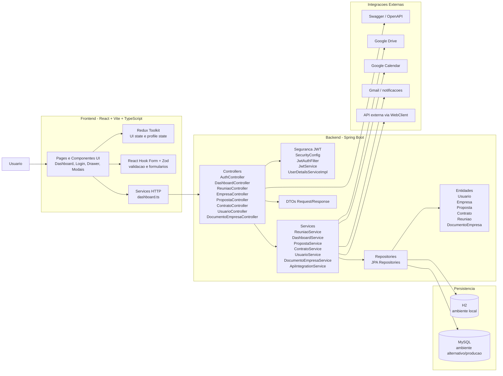
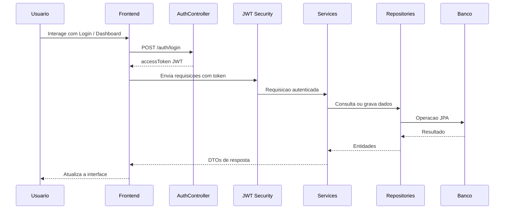

# Arquitetura Do Projeto

Este documento mostra a arquitetura completa do sistema Climbe, cobrindo frontend, backend, segurança, persistência e integrações.

## Visão Geral



## Camadas

### 1. Frontend
- Baseado em React com Vite e TypeScript.
- A tela principal de operação está centralizada em Dashboard.
- O estado global é controlado com Redux Toolkit.
- Formulários usam React Hook Form e Zod.
- As chamadas para backend ficam concentradas em services.

### 2. Backend
- Construído em Spring Boot 3.
- Controllers expõem endpoints REST.
- Services concentram regras de negócio.
- Repositories usam Spring Data JPA.
- DTOs isolam contratos de entrada e saída.
- A camada Security usa JWT para autenticação.

### 3. Segurança
- Login ocorre via AuthController.
- O token JWT é validado por JwtAuthFilter.
- UserDetailsServiceImpl carrega o usuário autenticado.
- SecurityConfig define quais rotas são públicas e quais exigem autenticação.

### 4. Persistência
- O ambiente local está configurado com H2 em memória.
- O projeto também possui dependência para MySQL.
- As entidades principais representam usuários, empresas, propostas, contratos, reuniões e documentos.

### 5. Integrações
- Swagger/OpenAPI documenta e testa os endpoints.
- O frontend já prevê fluxos de integração com Google Drive, Google Calendar e Gmail.
- Existe também uma integração externa via ApiIntegrationService.

## Fluxo Principal



## Fluxos Funcionais Mais Importantes

### Agenda e calendario
- Front chama endpoints de dashboard e reuniões.
- Backend consolida os eventos via DashboardService e ReuniaoService.
- O frontend renderiza agenda semanal, mensal e notificações de evento.

### Propostas comerciais
- Front cria e lista propostas.
- Backend valida permissões do usuário autenticado.
- Propostas aceitas podem originar contratos.

### Clientes / empresas
- Front lista empresas e abre detalhes por abas.
- Backend concentra dados de empresa, contratos, propostas, documentos e reuniões.

### Configurações e notificações
- Front controla preferências de perfil, segurança, notificações e integrações.
- Backend hoje já suporta base para autenticação e agenda.
- Disparo real de e-mail/notificação ainda pode ser evoluído como próximo passo.

## Estrutura Resumida

```text
Squad-19/
├── frontend/
│   ├── src/pages/
│   ├── src/components/
│   ├── src/store/
│   ├── src/services/
│   └── src/styles.css
├── gestao-contratos/
│   ├── src/main/java/.../controller/
│   ├── src/main/java/.../services/
│   ├── src/main/java/.../repository/
│   ├── src/main/java/.../Security/
│   ├── src/main/java/.../classes/
│   └── src/main/resources/application.properties
└── docs/
    └── arquitetura-do-projeto.md
```

## Observações
- O frontend e o backend estão separados, mas funcionam como uma aplicação web integrada.
- A arquitetura atual está organizada em camadas clássicas, o que facilita evolução e manutenção.
- O próximo passo natural de arquitetura seria consolidar notificações reais por e-mail e sincronizações externas no backend.